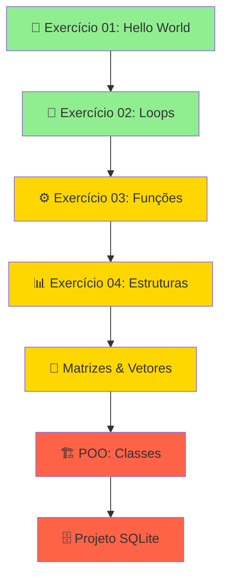

# 🐍 Exercícios em Python - Análise e Desenvolvimento de Sistemas

[](https://www.python.org/)
[](https://jupyter.org/)
[](https://colab.research.google.com/)
[](LICENSE)

> 🎓 **Repositório acadêmico** com exercícios desenvolvidos durante o 3º semestre do curso de **Análise e Desenvolvimento de Sistemas**.

## 🚀 **Execute os códigos com 1 clique!**

Todos os exercícios estão disponíveis como **Jupyter Notebooks** (.ipynb) e podem ser executados diretamente no **Google Colab** - **100% gratuito!**

---

## 📚 **Lista Completa de Exercícios**

### 🟢 **Módulo 1: Fundamentos Python**

<table>
<tr>
<td width="50%">

#### 📓 [`exercicio_01.ipynb`](exercicio_01.ipynb)
**🎯 Conceitos:** Variáveis, Input/Output, Condicionais  
**⏱️ Tempo:** 30 min | **📊 Exercícios:** 5

[](https://colab.research.google.com/github/danyel-oliveira/Exercicios_em_Python/blob/main/exercicio_01.ipynb)

**📋 O que você vai aprender:**
- ✅ Primeiro programa "Hello World"
- ✅ Entrada de dados com `input()`
- ✅ Operações matemáticas básicas
- ✅ Estruturas condicionais (`if`, `else`)
- ✅ Calculadora interativa

</td>
<td width="50%">

#### 📓 [`exercicio_02.ipynb`](exercicio_02.ipynb)
**🎯 Conceitos:** Loops, Range, Contadores  
**⏱️ Tempo:** 45 min | **📊 Exercícios:** 8

[](https://colab.research.google.com/github/danyel-oliveira/Exercicios_em_Python/blob/main/exercicio_02.ipynb)

**📋 O que você vai aprender:**
- ✅ Loop `for` com `range()`
- ✅ Loop `while` e condições
- ✅ Break e continue
- ✅ Loops aninhados
- ✅ Tabuada e contadores

</td>
</tr>
</table>

#### 📓 [`exercicio_03.ipynb`](exercicio_03.ipynb) - **Funções e Modularização**
**🎯 Conceitos:** def, return, parâmetros, escopo, docstrings  
**⏱️ Tempo:** 1h | **📊 Exercícios:** 10

[](https://colab.research.google.com/github/danyel-oliveira/Exercicios_em_Python/blob/main/exercicio_03.ipynb)

<details>
<summary>📋 <strong>Conteúdo Detalhado</strong></summary>

**📚 Módulos:**
1. **Criação de Funções** - Sintaxe `def` e chamada de funções
2. **Parâmetros e Argumentos** - Posicionais, nomeados, padrão
3. **Valores de Retorno** - `return` e múltiplos retornos
4. **Escopo de Variáveis** - Local vs Global
5. **Documentação** - Docstrings e boas práticas

**💻 Projetos Práticos:**
- 🧮 Calculadora com funções
- 📊 Sistema de notas
- 🎯 Validador de dados
- 🔢 Gerador de números primos

</details>

---

### 🟡 **Módulo 2: Estruturas de Dados**

<table>
<tr>
<td width="50%">

#### 📓 [`exercicio_04.ipynb`](exercicio_04.ipynb)
**🎯 Conceitos:** Listas, Dicionários, Tuplas  
**⏱️ Tempo:** 1.5h | **📊 Exercícios:** 12

[](https://colab.research.google.com/github/danyel-oliveira/Exercicios_em_Python/blob/main/exercicio_04.ipynb)

**📋 Estruturas:**
- 📋 **Listas:** append, remove, slice
- 📚 **Dicionários:** chaves, valores, items()
- 📦 **Tuplas:** imutabilidade, unpacking
- 🔄 **List Comprehensions**

</td>
<td width="50%">

#### 📓 [`Matrizes&Vetores.ipynb`](exercicio_Matrizes&Vetores.ipynb)
**🎯 Conceitos:** NumPy, Arrays 2D, Álgebra Linear  
**⏱️ Tempo:** 2h | **📊 Exercícios:** 15

[](https://colab.research.google.com/github/danyel-oliveira/Exercicios_em_Python/blob/main/exercicio_Matrizes&Vetores.ipynb)

**📋 Bibliotecas:**
- 🔢 **NumPy:** Arrays e operações
- 📊 **Matplotlib:** Gráficos básicos
- 📈 **Estatística:** Média, desvio padrão
- 🧮 **Álgebra:** Multiplicação matricial

</td>
</tr>
</table>

---

### 🔴 **Módulo 3: Programação Orientada a Objetos**

#### 📓 [`Questoes__POO_Python.ipynb`](questoes__POO_Python.ipynb) - **⭐ ESSENCIAL PARA ADS**
**🎯 Conceitos:** Classes, Objetos, Herança, Polimorfismo, Encapsulamento  
**⏱️ Tempo:** 3h | **📊 Exercícios:** 20

[](https://colab.research.google.com/github/danyel-oliveira/Exercicios_em_Python/blob/main/questoes__POO_Python.ipynb)

<details>
<summary>🏗️ <strong>Projetos Incluídos</strong></summary>

| 🎯 Projeto | 📝 Descrição | 🔧 Conceitos |
|------------|--------------|-------------|
| **📚 Sistema Biblioteca** | Gestão de livros e usuários | Classes, métodos, atributos |
| **👥 RH Empresarial** | Cadastro de funcionários | Herança, polimorfismo |
| **💰 Conta Bancária** | Operações financeiras | Encapsulamento, validação |
| **🛒 Loja Virtual** | E-commerce simples | Composição, agregação |
| **🚗 Concessionária** | Vendas de veículos | Herança múltipla |

**🎓 Conceitos Avançados:**
- 🔒 **Encapsulamento:** Atributos privados (`_private`)
- 🧬 **Herança:** Especialização de classes
- 🎭 **Polimorfismo:** Métodos com comportamentos diferentes
- 🏗️ **Composição:** Objetos dentro de objetos
- 🔧 **Métodos Especiais:** `__init__`, `__str__`, `__repr__`

</details>

---

### 🏆 **Módulo 4: Projeto Final**

#### 📓 [`ExercicioSQLite_POO_Python.ipynb`](ExercicioSQLite_POO_Python.ipynb) - **🚀 PROJETO PORTFÓLIO**
**🎯 Conceitos:** SQLite, CRUD, Integração BD + POO  
**⏱️ Tempo:** 4h+ | **📊 Sistema Completo**

[](https://colab.research.google.com/github/danyel-oliveira/Exercicios_em_Python/blob/main/ExercicioSQLite_POO_Python.ipynb)

<details>
<summary>🏢 <strong>Sistema Empresarial Completo</strong></summary>

**🗄️ Banco de Dados:**
- 📊 **SQLite:** Banco embarcado
- 🔧 **CRUD:** Create, Read, Update, Delete
- 🔐 **Autenticação:** Login e senhas
- 📈 **Relatórios:** Consultas avançadas

**💻 Funcionalidades:**
- 👤 Cadastro de usuários
- 🔒 Sistema de login
- 📊 Dashboard com estatísticas
- 💾 Backup automático
- 📋 Relatórios em PDF
- 🔍 Busca avançada

**🏗️ Arquitetura:**
- 📁 **MVC:** Model, View, Controller
- 🧩 **Classes:** Separação de responsabilidades
- ⚠️ **Tratamento de Erros:** Try/catch robusto
- 📝 **Logs:** Registro de atividades

</details>

---

## 📊 **Estatísticas do Curso**

<div align="center">

| 📈 Métrica | 📊 Valor | 🎯 Meta |
|------------|----------|---------|
| **Total de Exercícios** | 70+ exercícios | ✅ Completo |
| **Horas de Conteúdo** | 15+ horas | ✅ Intensivo |
| **Projetos Práticos** | 12 projetos | ✅ Hands-on |
| **Conceitos Cobertos** | 45+ conceitos | ✅ Abrangente |
| **Notebooks Interativos** | 8 notebooks | ✅ Moderno |

</div>

### 🏆 **Progressão de Aprendizado**



---

## 🚀 **Como Começar (3 Passos Simples)**

### 📋 **Passo 1: Escolha seu Nível**
- **🟢 Iniciante?** Comece com [`exercicio_01.ipynb`](exercicio_01.ipynb)
- **🟡 Intermediário?** Vá direto para [`exercicio_03.ipynb`](exercicio_03.ipynb)
- **🔴 Avançado?** Desafie-se com [`questoes__POO_Python.ipynb`](questoes__POO_Python.ipynb)

### 🌐 **Passo 2: Execute Online (Mais Fácil)**
1. Clique no botão []() de qualquer exercício
2. Faça login com sua conta Google (gratuito)
3. Execute célula por célula com `Shift + Enter`
4. **Salve uma cópia** no seu Google Drive: `Arquivo > Salvar uma cópia no Drive`

### 💻 **Passo 3: Pratique e Experimente**
- 🔧 Modifique os códigos
- 🧪 Teste suas próprias ideias
- 📝 Faça anotações nos notebooks
- 🤝 Compartilhe com colegas

---

## 🛠️ **Alternativas de Execução**

<div align="center">

| 🌐 Plataforma | 💰 Preço | 🎯 Melhor Para | ⭐ Nota |
|---------------|----------|----------------|---------|
| **Google Colab** | Gratuito | Iniciantes, ML | ⭐⭐⭐⭐⭐ |
| **Jupyter Local** | Gratuito | Desenvolvimento | ⭐⭐⭐⭐ |
| **Replit** | Freemium | Colaboração | ⭐⭐⭐⭐ |
| **GitHub Codespaces** | Pago | Profissional | ⭐⭐⭐ |

</div>

### 💻 **Executar Localmente:**
```bash
# 1. Clone o repositório
git clone https://github.com/danyel-oliveira/Exercicios_em_Python.git

# 2. Instale o Jupyter
pip install jupyter numpy matplotlib pandas

# 3. Inicie o Jupyter
jupyter notebook

# 4. Abra qualquer arquivo .ipynb
```

---

## 🎯 **Roteiros de Estudo**

### 🌱 **Iniciante (0-2 meses)**
**Objetivo:** Dominar os fundamentos

```
📅 Semana 1-2: exercicio_01.ipynb + exercicio_02.ipynb
📅 Semana 3-4: exercicio_03.ipynb (Funções)
📅 Semana 5-6: exercicio_04.ipynb (Estruturas)
📅 Semana 7-8: Projetos pessoais + revisão
```

### 🚀 **Intermediário (2-4 meses)**
**Objetivo:** Programação avançada

```
📅 Semana 1-2: Matrizes&Vetores.ipynb (NumPy)
📅 Semana 3-4: questoes__POO_Python.ipynb
📅 Semana 5-6: Projetos POO próprios
📅 Semana 7-8: Preparação para projeto final
```

### 💻 **Avançado (4+ meses)**
**Objetivo:** Projeto profissional

```
📅 Semana 1-4: ExercicioSQLite_POO_Python.ipynb
📅 Semana 5-8: Melhorias e funcionalidades extras
📅 Semana 9+: Deploy e documentação do projeto
```

---

## 🤝 **Comunidade e Suporte**

### 💬 **Dúvidas e Discussões**
- 🐛 **Issues:** Relate bugs ou dúvidas nas [Issues do GitHub](https://github.com/danyel-oliveira/Exercicios_em_Python/issues)
- 💭 **Discussions:** Participe das [Discussões](https://github.com/danyel-oliveira/Exercicios_em_Python/discussions)
- 📧 **Email:** [danyel.oliveira@exemplo.com](mailto:danyel.oliveira@exemplo.com)

### 🎯 **Como Contribuir**
1. 🍴 **Fork** este repositório
2. 🌿 **Crie uma branch:** `git checkout -b minha-melhoria`
3. ✨ **Implemente suas melhorias**
4. 📝 **Commit:** `git commit -m 'Adiciona exercício sobre recursão'`
5. 🚀 **Push:** `git push origin minha-melhoria`
6. 📋 **Abra um Pull Request**

### 💡 **Ideias para Contribuições**
- ➕ Novos exercícios sobre temas específicos
- 🌍 Tradução para outros idiomas
- 🎨 Melhorias na interface dos notebooks
- 📊 Visualizações de dados mais interessantes
- 🧪 Testes automatizados
- 📝 Mais exemplos práticos

---

## 📜 **Licença e Créditos**

Este projeto está licenciado sob a **MIT License** - veja o arquivo [LICENSE](LICENSE) para detalhes.

### 🙏 **Agradecimentos**
- 🎓 **Instituição de Ensino** - Por proporcionar o ambiente acadêmico
- 👨‍🏫 **Professores** - Pela orientação e conhecimento compartilhado  
- 👥 **Colegas de Turma** - Pela colaboração e troca de ideias
- 🐍 **Comunidade Python** - Por todas as ferramentas incríveis

---

<div align="center">

## ⭐ **Gostou do Repositório?**

Se este conteúdo foi útil para você:

[](https://github.com/danyel-oliveira/Exercicios_em_Python/stargazers)
[](https://github.com/danyel-oliveira/Exercicios_em_Python/fork)
[](https://github.com/danyel-oliveira/Exercicios_em_Python)

**🚀 Bons estudos e happy coding! 🐍**

---

*📅 Última atualização: 30/07/2025*  
*👨‍💻 Desenvolvido com ❤️ por [Danyel Oliveira](https://github.com/danyel-oliveira)*  
*🎓 Análise e Desenvolvimento de Sistemas - 4º Semestre*

[](#-exercícios-em-python---análise-e-desenvolvimento-de-sistemas)

</div>
